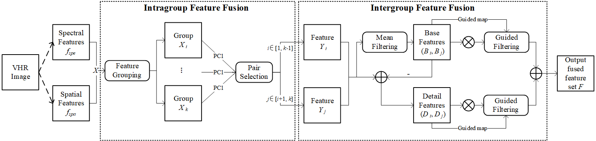

# A Novel Feature Fusion Approach for VHR Remote Sensing Image Classification

Here, we provide the MATLAB implementation of the paper: A Novel Feature Fusion Approach for VHR Remote Sensing Image Classification

For more ore information, please see our published paper at [IEEE JSTARS](https://ieeexplore.ieee.org/document/9277624)



## Requirement

```
MATLAB
SVM: RBF
```

## Quick Start

Just run the demo to get started as follows:

```
TsF_demo.m
```
After that, you can find the prediction results in `Result`.

## Dataset Preparation

### Data structure

```
"""
Image classification data set with pixel-level binary labels；
├─Image & ImageAP
├─label
├─train_set
└─test_set
"""
```

## License

Code is released for non-commercial and research purposes **only**. For commercial purposes, please contact the authors.

## Citation

If you use this code for your research, please cite our paper:

```
@ARTICLE{9277624,  
    author={Liu, Sicong and Zheng, Yongjie and Du, Qian and Samat, Alim and Tong, Xiaohua and Dalponte, Michele},  
    journal={IEEE Journal of Selected Topics in Applied Earth Observations and Remote Sensing},   
    title={A Novel Feature Fusion Approach for VHR Remote Sensing Image Classification},   
    year={2021},  
    volume={14},  
    number={},  
    pages={464-473},  
    doi={10.1109/JSTARS.2020.3041868}
}
```

## Acknowledgments

Our code is inspired by [MATLAB-EMAP/SVM(RBF)](https://github.com/Vikki23/Demo_spectral_spatial_hyperspectral_classification), [Image Fusion With Guided Filtering (GFF)](https://ieeexplore.ieee.org/document/6423909).
